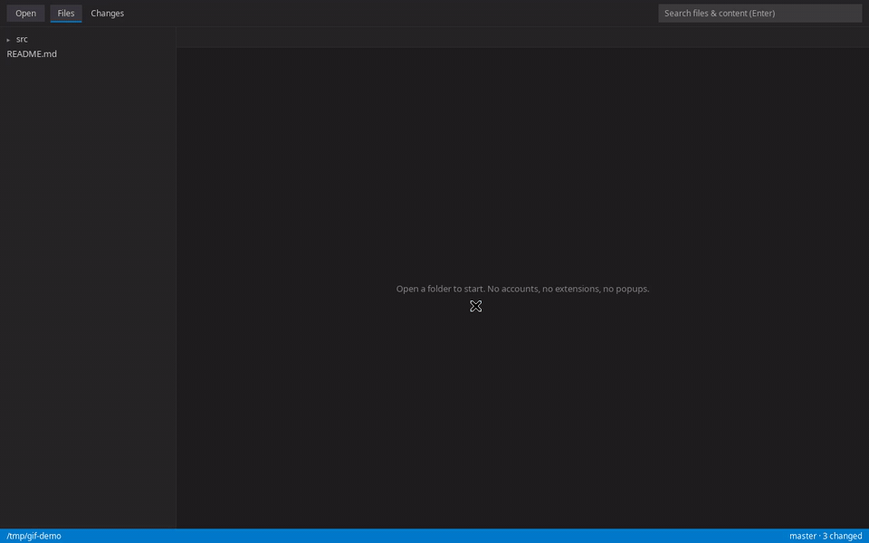

# minimal-editor

A minimal, fast, VS Code–familiar editor for quickly looking at code changes.
No extensions. No telemetry. No agent upsell popups. Ever.

**Docs & download:** https://nitishagar.github.io/minimal-editor/

Built on the same editing engine as VS Code ([Monaco](https://github.com/microsoft/monaco-editor))
inside a tiny [Tauri](https://github.com/tauri-apps/tauri) shell (system webview + Rust)
— with only four features:

- **Files** — folder tree, tabs, syntax highlighting, save (Ctrl+S)
- **Changes** — git status list, side-by-side diffs, `[` / `]` to step through changes
- **Search** — filename + content search across the project (Enter)
- **Nothing else** — no accounts, no marketplace, no update prompts, no network calls



The app makes no network calls: there are no HTTP client crates in the Rust
backend, no remote URLs in source, and a strict CSP. CI runs a **ban gate**
(`scripts/ban-gate.sh`) that fails the build on any telemetry/agent string,
remote URL, or HTTP crate.

## Performance

Measured on the dev machine (Ubuntu, release build):

| Metric | Value |
|---|---|
| Cold boot to interactive | ~1.1 s |
| Full 14-case e2e suite (boot + all features) | ~1.9 s |
| Binary | 7 MB |
| `.deb` installer | 4 MB |

For comparison, the v0.1.0 Electron shell booted in ~1.4 s and installed at
~200 MB. The Tauri port (§Port notes) is ~40× smaller and faster to start,
with the entire suite green in under two seconds.

## Quick start

Requirements: Node.js 20+, Rust stable, git, and the [Tauri Linux prerequisites](https://v2.tauri.app/start/prerequisites/)
(`libwebkit2gtk-4.1-dev` etc.). macOS and Windows need only Rust + Node.

```bash
git clone https://github.com/nitishagar/minimal-editor.git
cd minimal-editor
npm install
npm run dev [path/to/repo]   # dev build with hot reload
```

Prebuilt binaries for Linux (`.deb`/`.rpm`/`.AppImage`), macOS (`.dmg`) and
Windows (`.msi`) are produced by CI on every push — see the `release` job's
artifacts.

Other commands:

| Command | What it does |
|---|---|
| `npm run build` | Release build + platform installers (`src-tauri/target/release/bundle/`) |
| `npm test` | Ban gate + typecheck + Rust unit tests (`cargo test`) |
| `npm run e2e` | Headless e2e suite: boots the app, asserts all 14 feature cases |
| `npm run ban-gate` | Fail on telemetry/agent strings, remote URLs, or HTTP crates |

Keyboard: `Ctrl+O` open folder · `Ctrl+S` save · `Ctrl+W` close tab ·
`[` / `]` previous/next change (in a diff).

## Why not a full VS Code fork?

A full `microsoft/vscode` (Code-OSS) build carries the entire workbench:
extension host, marketplace, settings sync, experiments service, and the
agent/Copilot surfaces. Stripping that down by subtraction fights the codebase
and still ships its weight. VSCodium proves the point from the other side: it
is explicitly *not* a fork, just build scripts over Microsoft's repo — same
full-weight VS Code.

So minimal-editor starts from zero and adds up instead: Monaco for the editor
(VS Code's own engine, MIT) and ~2k lines of our own code for tree/tabs/diff/search. See
[`thoughts/shared/minimal-editor/`](thoughts/shared/minimal-editor/) for the
research → plan → implement trail.

## Port notes (v0.1.0 Electron → Tauri)

- The v0.1.0 tag keeps the original Electron shell; `main` is Tauri.
- Renderer (`src/`) is unchanged apart from the backend adapter (`src/api.ts`):
  all desktop I/O was already behind one interface, so the port swapped
  Electron IPC for Tauri commands with no UI changes.
- The old `electron/*.cjs` helpers were ported 1:1 to `src-tauri/src/core/`
  (`fs.rs`, `git.rs`) with the same unit tests, now in Rust.
- On machines without root, webkit headers can be extracted user-space from
  `.deb`s (see `scripts/env.sh`); CI installs real `-dev` packages via apt.

## Project layout

```
src/           renderer.ts (tree/tabs/editor/diff/search UI), api.ts, styles.css
src-tauri/     main.rs (window + commands + e2e harness),
               core/fs.rs + core/git.rs (local-only helpers, unit-tested)
e2e/           driver.js (14 headless feature cases, see below)
scripts/       ban-gate.sh, env.sh
thoughts/      research → plan → implement loop artifacts
```

## Test suites

- **Rust unit tests** (`npm run test:rs`, 12 cases): filesystem tree/read/write/search
  and git status/diff/show/branch/log against temp fixtures, including path-traversal
  rejection and symlink-escape rejection.
- **E2E suite** (`npm run e2e`, 14 cases in `e2e/driver.js`): boots the real app
  headlessly and asserts every shipped feature — folder open, tree, file open,
  Monaco insert/undo/cursor, save-to-disk, binary refusal, git status/branch/head,
  side-by-side diff with computed line changes, change stepping, search hits,
  tab open/close, traversal rejection, and zero remote resource loads.
  Monaco *is* VS Code's editor, so these drive the same editor code paths
  (models, edits, undo stack, diff mapping) that VS Code's own editor tests cover.

## License

MIT — see [LICENSE](LICENSE).
